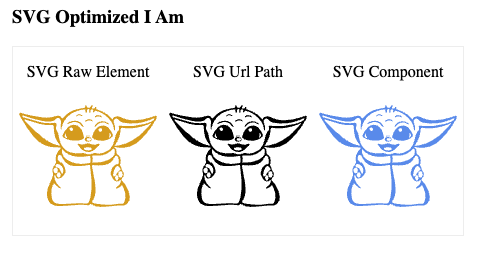

# Vite Plugin Svelte SVGR

<div style="margin-bottom: 12px;">
  
</div>

A Vite plugin which enables SVG import similar to what you may be accustomed to in React. While this plugin or similar may be required for your needs I would encourage you to consider using a library such as [Iconify](https://docs.iconify.design/) if you are only interested in using Icons from icon sets.

If you still need to manage one off or custom SVG elements in [SvelteKit](https://kit.svelte.dev/) then this will work as needed and will provide proper types for Typescript users.

[See Instructions for Typescript](#imports-with-typescript)

## Install

```sh
pnpm i vite-plugin-svelte-svgr -D
```

```sh
yarn add vite-plugin-svelte-svgr --dev
```

```sh
npm install vite-plugin-svelte-svgr -D
```

## Configuration

Import the plugin and extend `svelte.config.js` with an instance of the plugin containing your options as shown below.

### @sveltejs/kit@1.0.0-next.346 and Above

Defined in `vite.config.js`

```js
import svg from 'vite-plugin-svelte-svgr';

const config = {
	// see https://github.com/svg/svgo for svgo plugin options.
	plugins: [svg()]
};
export default config;
```

### @sveltejs/kit@1.0.0-next.345 and Below

```js
import svg from 'vite-plugin-svelte-svgr';

/** @type {import('@sveltejs/kit').Config} */
const config = {
  ...,
  kit: {
    ...,
    vite: {
      // see https://github.com/svg/svgo for svgo plugin options.
      plugins: [svg()]
    }
  }
};
export default config
```

### Advanced Options

It's not uncommon to have one group of svg icons that you use as urls or raw only, while others you may wish to use as a component. This can be achieved by defining your include/exclude parameters along with whatever [SVGO](https://github.com/svg/svgo) options you wish to use.

The following options would be passed to the `svg()` plugin init function as shown above. As explained for newer version of `SvelteKit` this would be defined in the plugins property found in `vite.config.js`. For older versions of `SvelteKit` this would be defined in the plugins property of `svelte.config.js` under `kit.vite`.

```js
const svgoOptions = {
	multipass: true,
	plugins: [
		// Ensuring viewbox isn't removed.
		{
			name: 'preset-default',
			params: {
				overrides: {
					removeViewBox: false
				}
			}
		},
		{
			// setting fill attribute to "currentColor"
			name: 'addAttributesToSVGElement',
			params: {
				attributes: [{ fill: 'currentColor' }]
			}
		}
	]
};
```

## Basic Usage

**Import as Component:**

Use the component as you would any Svelte component including passing props.

```svelte
<script>
  import Logo from "./logo.svg";
</script>

<Logo width={200} />
```

Or perhaps a class when using [Tailwind](https://tailwindcss.com/)

```svelte
  <Logo class="w-5 h-5">
```

**Url Import**

```svelte
<script>
  import logoUrl from "./logo.svg?url";
</script>


```

**Raw Import**

```svelte
<script>
  import logo from "./logo.svg?raw";
</script>

{@html logo}
```

## Options

While not using [Rollup](https://rollupjs.org/guide/en/) we are underneath using a filtering tool created for Rollup. For [reference](https://github.com/rollup/plugins/tree/master/packages/pluginutils#createfilter) for more information on how to use `root`, `include` and `exclude` properties.

```ts
interface Options {
	/**
	 * The default output type for imported SVG.
	 *
	 * @default 'component'
	 */
	type?: SvgType;

	/**
	 * The root path that below include/exclude scopes will be resolved from.
	 * If undefined process.cwd() is used and likely what you want.
	 *
	 * @default undefined
	 */
	root?: string;

	/**
	 * The scopes/paths to be processed. If undefined all resolved SVG are processed.
	 *
	 * @default undefined
	 */
	include?: FilterPattern;

	/**
	 * The scopes/paths to be excluded. If undefined no svg files will be unprocessed.
	 *
	 * @default undefined
	 */
	exclude?: FilterPattern;

	/**
	 * Specify svgo options, leave undefined for defaults or false to disabled
	 * optimization. The plugin will also look for `svgo.config.js` if you prefer
	 * a configuration file.
	 *
	 * @see https://github.com/svg/svgo
	 * @default undefined
	 */
	svgo?: OptimizeOptions | boolean;
}
```

## Imports with Typescript

You'll likely want to create a reference to the ambient modules types in your `app.d.ts` (for Svelte Kit) or applicable. Typescript will likely complain about importing a path like`./path/to/some.svg?component`;

Simply add the reference to our plugin module and the error should go away. **After updating you may need to close your editor or restart the [Typescript](https://www.typescriptlang.org/) server**.

```ts
/* app.d.ts or other global types file */
/// <reference types="vite-plugin-svelte-svgr" />
```

## Jest Testing

To make [Jest](https://jestjs.io/) happy you'll need to adjust your `jest.config.js` telling Jest how to handle `.svg` components. There are a couple of ways of doing this. Here's one.

Install the `jest-transform-stub`

```js
module.exports = {
  ...
  moduleNameMapper: {
    '^.+\\.svg$': 'jest-transform-stub',
  }
};
```

Another options is to create a Mock component then point the module mapper to the Mock component. This is similar to what you might do with React and `createClass`.

**Create Mock Component**

Create an empty SVG element at `src/lib/icons/Mock.svelte`

```svelte
<svg />
```

**Update Jest Config**

Update module name mapper to reflect the above path in your `package.json` or jest config file.

```js
module.exports = {
	moduleNameMapper: {
		'^.+\\.svg$': '<rootDir>/src/lib/icons/Mock.svelte'
	}
};
```

## Docs

See [https://blujedis.github.io/vite-plugin-svelte-svgr/](https://blujedis.github.io/vite-plugin-svelte-svgr/)

## License

See [LICENSE](LICENSE)
